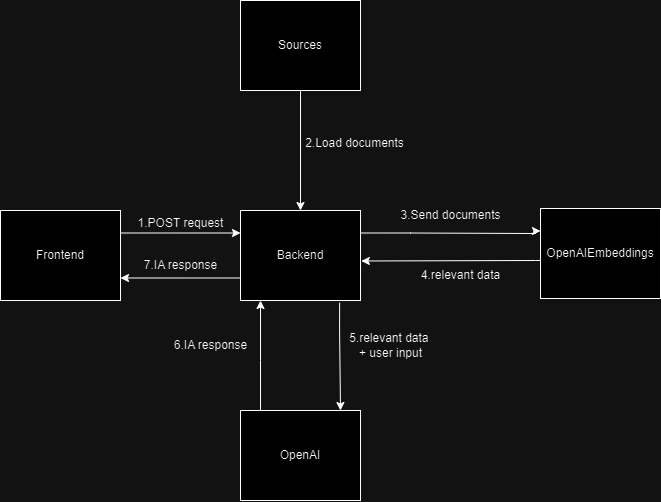

### Project Overview:

The approach that I use was first learn about the LangChain library, to know about the tools that I have to use. Then using the documentation of the How-to guides I started to create the code for the conversational RAG. First I started using Ollama as LLM but then it started to take a long time to give me the responses and it was then when I encountered my first problem. To solutionate this what I did was implement first Groq, but when I was asking the questions of "What are the services of Promtior?" it responded me that it had no information about that company, so I tried changing the  model to the OpenAI with the embeddings and it worked without any problems. With the rest of the code I didn't have mayor problems because almost everything worked instantly by following the LangChain documentation.
To finalize with the code in Python I created an api with FastAPI, to which I can make request from the frontend. In this part I had problems separating the code due to relative imports, but I solve it by using absolute imports and executing the Python script with uvicorn from the root carpet.

For the front I did a simple page with HTML, CSS and JavaScript vanilla. This was very simple to realize and I didn't have mayor problems. The behavior it's the following: The user joins in the page and it can send a message throught an input, once the message is sended this is added to the list of messages and a POST request is made to the backenbd, once the response is obtained the message of the IA s showed in the messages list and done.

Other of the problemas that I have was when I was deploying the code in AWS. First the backend of Python wasn't working but it was my error because I was using a package that it wasn't to launch the server, so I solve it by using the correct package. Then the frontend wasn't working when before it was working, but this last part I can solve it by rebooting the AWS instance.

To access the project you have to open http://3.16.70.184/

### Component Diagram:

